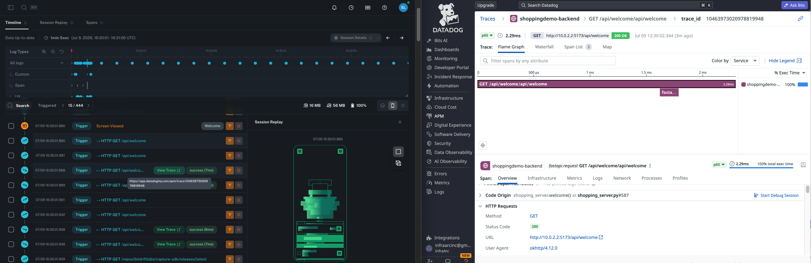

# Bitdrift Shop Backend API

FastAPI server providing realistic e-commerce data for the **Bitdrift Shop** app used in the **Bitdrift 301 SDK Workshop**. Serves a catalog of 18 products with randomized browsing, search, cart management, checkout, and payment flows.

Server runs on `http://localhost:5173`.

---

## What This Demo Shows

This backend is the **server-side half of an end-to-end observability demo**, pairing bitdrift with Datadog:

- **Client side** — the Bitdrift Shop mobile app (iOS/Android/React Native) is instrumented with the bitdrift Capture SDK, capturing every network request/response, session, and crash on-device: latency, status codes, payload sizes, and failures exactly as the user experienced them.
- **Server side** — this backend is instrumented with **Datadog APM** (`ddtrace`). Every request gets its own distributed trace (service `shoppingdemo-backend`), and the matching `dd.trace_id` / `dd.span_id` is injected into the server's structured JSON logs for that request.

Put together, a workshop attendee can follow one shopping session end-to-end:

1. Trigger a request from the mobile app (browsing, checkout, a chaos-injected failure, etc.) and see it land in bitdrift — latency, response size, status.
2. Tail this backend's logs (`docker logs -f bitdrift-shop-backend`) and find the matching request, which carries a `dd.trace_id`.
3. Paste that trace ID into Datadog APM (Traces, filtered to `service:shoppingdemo-backend`) to see the exact backend trace, spans, and correlated logs for that same request.

This connects **client-side observability (bitdrift)** to **server-side observability (Datadog)** for the same request — the thing that's normally hardest to do across two separate tools.



The heavy endpoints' built-in artificial latency and the [chaos mode](#chaos-mode) fault injection exist specifically to generate interesting, visibly-different requests to correlate this way (see [Response Latency](#response-latency) and [Response Sizes](#response-sizes-by-endpoint) below).

---

## Workshop Quick Start

If you're here for the workshop, this is all you need:

```bash
./start-backend-docker.sh        # build from source and run
./start-backend-chaos-docker.sh  # same, with chaos mode enabled (fault injection)
./stop-backend-docker.sh         # stop the running container
```

No Python, no virtualenv — just Docker. The image is built locally from the `Dockerfile` in this directory (not pulled from Docker Hub), so any source changes take effect on the next `./start-backend-docker.sh` run.

**Chaos mode** is used in workshop scenarios that test error handling and resilience — it injects random API faults (slow responses, 500 errors, payment failures) so the SDK can capture and surface them.

---

## Datadog Agent Setup

Traces, runtime metrics, and log correlation all flow to a local Datadog Agent, which forwards them to Datadog. You need one running before traces will show up.

### 1. Start the agent

```bash
docker run -d --name dd-agent \
  -e DD_API_KEY=<YOUR_DATADOG_API_KEY> \
  -e DD_SITE="datadoghq.com" \
  -e DD_DOGSTATSD_NON_LOCAL_TRAFFIC=true \
  -v /var/run/docker.sock:/var/run/docker.sock:ro \
  -v /proc/:/host/proc/:ro \
  -v /sys/fs/cgroup/:/host/sys/fs/cgroup:ro \
  -v /var/lib/docker/containers:/var/lib/docker/containers:ro \
  registry.datadoghq.com/agent:7
```

Replace `<YOUR_DATADOG_API_KEY>` with an API key from your Datadog org (**Organization Settings → API Keys**). The container must be named `dd-agent` — the backend looks it up by that name.

Works the same way against Colima, Docker Desktop, or plain Docker — no host networking tricks needed. (Tested and verified against a local Colima setup.)

### 2. Connect it to the backend's network

The backend reaches the agent by container name (`DD_AGENT_HOST=dd-agent`) over a shared Docker network called `dd-network`, so both containers need to be on it. `./start-backend-docker.sh` and `./start-backend-chaos-docker.sh` do this automatically — they create `dd-network` if it doesn't exist and connect the running `dd-agent` container to it. If `dd-agent` isn't running yet, the scripts print a warning and start the backend anyway (traces just won't reach Datadog until the agent is up and connected).

To wire it up manually instead:

```bash
docker network create dd-network
docker network connect dd-network dd-agent
```

### 3. Verify

```bash
docker exec dd-agent agent status   # confirm the agent is healthy
curl http://localhost:5173/api/welcome
docker logs bitdrift-shop-backend | tail -5   # look for a dd.trace_id on the request
```

If you see a `dd.trace_id` / `dd.span_id` pair on a logged request, traces are flowing — that request will show up under service `shoppingdemo-backend` in Datadog APM within a few seconds.

---

## API Docs

- **Swagger UI**: `http://localhost:5173/docs`
- **ReDoc**: `http://localhost:5173/redoc`

## Endpoints

| Method | Path | Description |
|--------|------|-------------|
| GET | `/api/health` | Health check |
| GET | `/api/welcome` | Store info + promotions |
| GET | `/api/browse` | Product listing (8 random of 18) |
| GET | `/api/search?q=` | Search products by keyword |
| GET | `/api/featured` | Featured products with badges |
| GET | `/api/categories` | Category listing |
| GET | `/api/categories/{name}` | Products in a specific category |
| GET | `/api/product/{id}` | Product detail with images |
| GET | `/api/product/{id}/reviews` | Product reviews + ratings |
| GET | `/api/cart` | Get current cart contents |
| POST | `/api/cart` | Add item to cart → cart summary |
| DELETE | `/api/cart/{product_id}` | Remove item from cart |
| POST | `/api/wishlist` | Add to wishlist |
| POST | `/api/checkout/guest` | Guest checkout session |
| POST | `/api/checkout/signin` | Member checkout session |
| POST | `/api/payment/card` | Card payment → transaction ID |
| POST | `/api/payment/applepay` | Apple Pay → transaction ID |
| POST | `/api/payment/paypal` | PayPal → transaction ID |
| POST | `/api/payment/androidpay` | Android Pay → transaction ID |
| GET | `/api/confirmation/{id}` | Order confirmation details |
| GET | `/api/inventory/lookup/{item}/{session}` | Inventory lookup (cardinality demo) |

### Response Latency

Heavy endpoints have built-in artificial latency (independent of chaos mode) to create visible response time differences — useful for spotting the same slow request in both bitdrift and a Datadog trace flame graph:

| Endpoint | Latency | Rationale |
|----------|---------|----------|
| `GET /api/product/{id}/reviews` | 400–1200ms | Simulates review aggregation query |
| `GET /api/confirmation/{id}` | 300–800ms | Simulates order assembly + recommendation engine |
| `GET /api/product/{id}` | 200–600ms | Simulates DB joins across related products, Q&A, price history |
| All other endpoints | instant | No artificial delay |

## Response Sizes by Endpoint

Endpoints are deliberately sized to create dramatic bandwidth differences visible in the Bitdrift dashboard's "request/response size by endpoint" charts:

| Endpoint | Approx. Size | Latency | What makes it large |
|----------|-------------|---------|---------------------|
| `GET /api/product/{id}/reviews` | **~330 KB** | 400–1200ms | 150 full reviews with author profiles, photos, seller responses, pros/cons |
| `GET /api/confirmation/{id}` | **~95 KB** | 300–800ms | 8-18 line items, 15 recommendations, 12 "also viewed" with preview reviews, policies |
| `GET /api/product/{id}` | **~76 KB** | 200–600ms | Related products, 30 Q&A threads, competitor comparison matrix, 90-day price history |
| `GET /api/browse` | **~8 KB** | instant | 8 enriched product cards with trending data, shipping estimates, promotions, seller info |
| `GET /api/welcome` | ~0.2 KB | instant | Store info + 2 promos |
| `POST /api/payment/*` | **~0.2 KB** | instant | Minimal: status, transaction ID, order ID, amount |

The heavy endpoints also have **artificial latency** injected server-side, so both the "response size by endpoint" and "response time by endpoint" charts show dramatic differences in the dashboard.

---

## Datadog APM

The server starts under `ddtrace-run` (set as the Docker `CMD`), which auto-instruments FastAPI/Starlette/ASGI — no code changes needed to get a trace per request. Key env vars, set in the `Dockerfile`:

| Variable | Default | Purpose |
|----------|---------|---------|
| `DD_SERVICE` | `shoppingdemo-backend` | Service name traces/logs are tagged with in Datadog |
| `DD_ENV` | `demo` | Environment tag |
| `DD_AGENT_HOST` | `dd-agent` | Where to send traces/DogStatsD — the agent container's name on `dd-network` |
| `DD_TRACE_AGENT_PORT` | `8126` | APM receiver port on the agent |
| `DD_DOGSTATSD_HOST` | `dd-agent` | Where to send runtime metrics |
| `DD_RUNTIME_METRICS_ENABLED` | `true` | Python runtime metrics (GC, memory, threads) via DogStatsD |
| `DD_LOGS_INJECTION` | `true` | Stamps `dd.trace_id`/`dd.span_id` onto every log record when a span is active |

Point the container at a different agent without rebuilding:

```bash
DD_AGENT_HOST=your-agent-host DD_TRACE_AGENT_PORT=8126 docker compose up --build
```

**Log correlation**: logs are emitted as structured JSON to stdout. Whenever a request is being traced, the log line for it carries `dd.trace_id` and `dd.span_id`:

```json
{"timestamp": "...", "severity": "INFO", "message": "GET /api/browse HTTP/1.1\" 200", "logger": "uvicorn.access", "dd.trace_id": "6a4fa9b900...", "dd.span_id": "11570579908245519352"}
```

That's the same trace ID Datadog assigns to the request — search for it in APM once the agent is also configured for log collection, to jump straight from a log line to its trace (and back).

---

## Build and Run Locally (Docker)

For backend development — build your own image from source:

```bash
./build.sh          # build image (stevelerner/bitdrift-shop-backend:latest)
./run.sh            # run the locally built image (also joins dd-network)
./docker-cleanup.sh # stop and remove the container
```

### Push to Docker Hub

```bash
./dockerhub-push.sh           # push latest
./dockerhub-push.sh v1.0.0    # tag and push version
```
---

## Docker Compose

The scripts are thin wrappers around `docker-compose.yml`. The `backend` service builds from the local `Dockerfile` and attaches to the external `dd-network` (see [Datadog Agent Setup](#datadog-agent-setup) above), which must exist before running compose directly:

```bash
docker network create dd-network         # if it doesn't already exist
docker compose up --build                # build from source and start — Ctrl-C to stop
docker compose down                      # remove the container

TAG=v1.0.0 docker compose up --build     # tag the built image as v1.0.0
CHAOS_MODE=1 docker compose up --build   # chaos mode
```
---

## Run without Docker

> **Deprecated** — the `local/` scripts now just delegate to the Docker scripts above. Direct Python startup is no longer maintained.

To run without Docker, install dependencies and start the server manually:

```bash
python3 -m venv venv
source venv/bin/activate
pip install -r requirements.txt
python shopping_server.py

# Chaos mode:
CHAOS_MODE=1 python shopping_server.py
```

Note: without `ddtrace-run` in front of it, traces won't be generated this way — it's for quick local iteration on the API responses only.

### Clean up local dev files

```bash
./cleanup.sh  # removes venv, __pycache__, .pyc files
```

---

## Product Images

The server serves product images at `/images/{product_id}.png`. The 18 images are **committed to the repo** and included in the Docker image — no generation step is needed for normal use.

### Regenerating images (Pexels API)

To refresh the images with new photos from [Pexels](https://www.pexels.com/):

```bash
python3 -m venv .venv
source .venv/bin/activate
pip install Pillow

PEXELS_API_KEY=<your-key> python generate_images.py
```

Get a free API key at https://www.pexels.com/api/. The script searches Pexels for each product, downloads the top result, center-crops to square, and resizes to 400×400. If a search fails, it falls back to a gray placeholder with the product initials.

After regenerating, rebuild the Docker image to include the new images:

```bash
./build.sh
```

## Chaos Mode

Chaos mode injects random faults into API responses for resilience testing. Faults are applied probabilistically — each request rolls the dice independently.

### Activation

**Option 1 — Docker** (recommended):

```bash
./start-backend-chaos-docker.sh
```

**Option 2 — Local startup script:**

```bash
./local/start-backend-chaos.sh
```

**Option 3 — Environment variable:**

```bash
CHAOS_MODE=1 python shopping_server.py
```

**Option 4 — Runtime toggle** (enable/disable without restart):

```bash
curl -X POST http://localhost:5173/api/chaos/enable
curl -X POST http://localhost:5173/api/chaos/disable
```

**Option 5 — Per-request** (header or query param):

```bash
curl -H "X-Chaos: on" http://localhost:5173/api/browse
curl http://localhost:5173/api/browse?chaos=1
```

### Fault Types

| Fault | Default Probability | Effect |
|-------|-------------------|--------|
| `slow_response` | 15% | 2–12 second delay |
| `http_404` | 8% | Not Found |
| `http_500` | 6% | Internal Server Error |
| `http_503` | 4% | Service Unavailable with Retry-After |
| `slow_images` | 25% | 3–8 second delay on image requests |
| `truncated_json` | 4% | Malformed JSON body |
| `empty_lists` | 7% | Arrays replaced with `[]` |
| `stale_data` | 8% | Product detail returns mutated price, zero stock, or "[DISCONTINUED]" name |
| `payment_failure` | 12% | Payment endpoints return decline/timeout error |
| `session_expiry` | 8% | 401 Unauthorized on checkout/payment |
| `rate_limiting` | 4% | 429 Too Many Requests |

### Control Endpoints

| Method | Path | Description |
|--------|------|-------------|
| POST | `/api/chaos/enable` | Turn chaos mode on |
| POST | `/api/chaos/disable` | Turn chaos mode off |
| GET | `/api/chaos/status` | Current config and hit stats |
| POST | `/api/chaos/configure` | Update fault probabilities |
| POST | `/api/chaos/reset-stats` | Zero out hit counters |

**Example — increase payment failures to 50%**:

```bash
curl -X POST http://localhost:5173/api/chaos/configure \
  -H "Content-Type: application/json" \
  -d '{"fault_type": "payment_failure", "probability": 0.5}'
```

**Example — check stats**:

```bash
curl http://localhost:5173/api/chaos/status
```

## Cleanup

Remove generated files (venv, images, `__pycache__`):

```bash
./cleanup.sh
```
