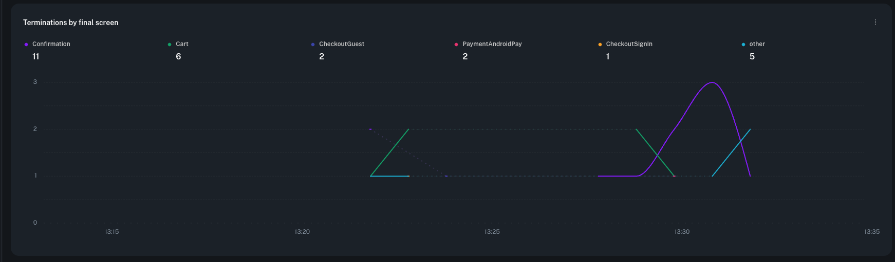

# Which screen were users on when the app died?

Crash reports tell you *what* broke, not *where the user was*. This adds that, in
two small code changes and one workflow.

## Why the obvious approach doesn't work

The intuitive answer is a Sankey ending in a crash: screen views in, crash out.
It usually comes back empty, for one reason:

**The crash is often not in the same session as the screen views.**

- App hangs (`0x8BADF00D`) and out-of-memory kills produce no log at the moment
  they happen — the process is simply gone. The OS report arrives on the **next
  launch**, in a **new session**.
- Any app that calls `startNewSession()` splits its own screen views away from
  whatever happens later.
- A launch anchor like `SDK_CONFIGURATION` fires once per *process*, so it isn't
  in the session that eventually crashes either.

A workflow step can only match events it can see in one session, so the flow
never reaches its final step. Fields don't have that problem — so use fields.

---

## Step 1 — tag every screen view with a field

Wherever you already call `logScreenView`, also set a global field. Global fields
attach to every later log **and to the crash report itself**.

**iOS**
```swift
func onScreen(_ name: String) {
    Logger.logScreenView(screenName: name)
    Logger.addField(withKey: "last_screen", value: name)          // rides along on crashes
    UserDefaults.standard.set(name, forKey: "last_screen")        // survives the process dying
}
```

**Android**
```kotlin
fun onScreen(name: String) {
    Logger.logScreenView(name)
    Logger.addField("last_screen", name)
    prefs.edit().putString("last_screen", name).apply()
}
```

That alone makes crashes groupable by `last_screen`.

## Step 2 — report the previous run at startup

This is what catches hangs and OOM kills, which Step 1 can't: they leave no log
behind, so you report them *after* the restart.

**iOS** — in `application(_:didFinishLaunchingWithOptions:)` or `App.init()`,
**before** logging your first screen view:

```swift
if let info = Logger.previousRunInfo {
    Logger.logError("previous_run_terminated", fields: [
        "termination_reason": info.terminationReason.rawValue,   // fatalCrash, cleanExit, ...
        "crashed_on_screen": UserDefaults.standard.string(forKey: "last_screen") ?? "unknown",
    ])
}
```

Order matters: read the saved value before the new session overwrites it.

## Step 3 — deploy the workflow

Edit [`last-screen-before-crash.workflow.json`](last-screen-before-crash.workflow.json),
replace `<YOUR_IOS_APP_ID>`, then:

```bash
bd workflow create last-screen-before-crash.workflow.json \
  --metadata-file       last-screen-before-crash.metadata.json \
  --chart-metadata-file last-screen-before-crash.chart-metadata.json
# returns an id
bd workflow deploy <id>
```

Pass all three files. The two metadata files only carry titles and a description —
skip them and every chart renders with the same fallback label, which looks like
duplicate charts.

You get two charts:

| Chart | Grouped by | Answers |
|-------|-----------|---------|
| Terminations by screen | `crashed_on_screen` | **which screen users were on when the app died** |
| Terminations by reason | `termination_reason` | crash vs. clean exit vs. OS update |



One series per screen, counted over time — so you can see both the overall
distribution and whether a particular screen starts spiking after a release.

The **`other`** bucket is worth watching: it means the app died before reaching
any screen, which is usually a crash or hang during launch.

---

## Notes

- **Workflows only evaluate sessions that start after deployment.** Relaunch the
  app before judging whether it works.
- **Results are one launch behind.** A crash now is reported on the next start,
  so allow a couple of crash/relaunch cycles before data appears.
- **`termination_reason` matters.** Most terminations are clean exits. Filter to
  `fatalCrash` for real crashes, or keep them all to see a crash *rate*.
- **Add your own dimension.** If you have a notion of funnel stage — checkout,
  payment, onboarding — set it as a second field and group by that too. Screen
  names tell you where; a funnel stage tells you what it cost.
- **Step 1 alone is enough** if you only care about ordinary crashes. Step 2 is
  what buys you hangs and OOM kills, which for many iOS apps are the largest
  crash class by volume.
- **Renaming charts later** needs the workflow resent alongside them —
  `--chart-metadata-file` accepts only one entry on its own:
  ```bash
  bd workflow update --workflow-id <id> \
    --workflow-file       last-screen-before-crash.workflow.json \
    --metadata-file       last-screen-before-crash.metadata.json \
    --chart-metadata-file last-screen-before-crash.chart-metadata.json
  ```

Reference implementation: [`bitdrift-shop/ios`](../../bitdrift-shop/ios) —
`ScreenLogger.swift` (Step 1) and `CaptureBridge.swift` (Step 2).
