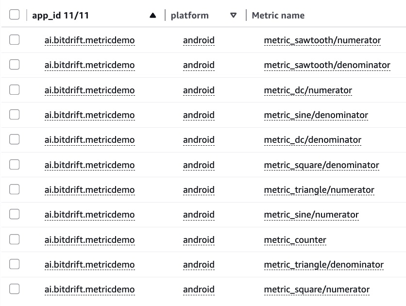
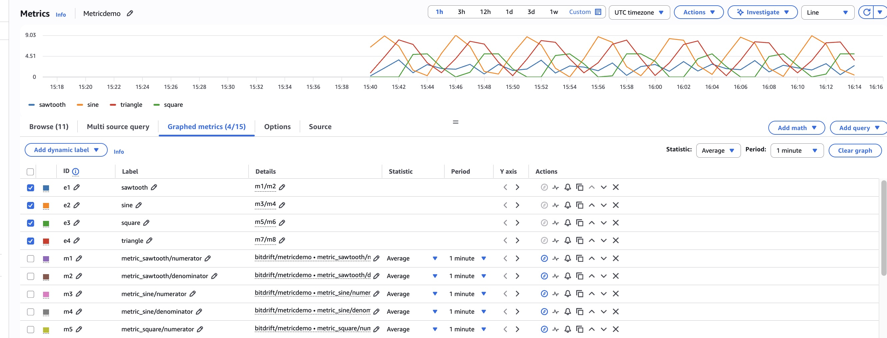

# metricdemo (Android)

An Android app that generates five test waveforms, logs them to bitdrift every second, and renders them live on screen. Use it to compare bitdrift dashboard charts against CloudWatch or other metric backends.

> [bitdrift Documentation](https://docs.bitdrift.io/) | [bitdrift Dashboard](https://bitdrift.io/login)

## What It Does

A single screen displays five metrics, each updating every second:

| Metric | Formula | Range | Period | Aggregation |
|--------|---------|-------|--------|-------------|
| sine | `5 + 5·sin(2π·t/300)` | 0–10 | 5 min | average |
| square | `0 if t%300 < 150, else 5` | 0 or 5 | 5 min | average |
| sawtooth | `(t % 150) / 150 × 5` (ramps 0→5) | 0–5 | 2.5 min | average |
| triangle | rises 0→10 then falls 10→0 | 0–10 | 5 min | average |
| dc | `5.0` constant | 5 | — | average |
| counter | `1.0` per tick | 1 | — (cumulative) | **sum** |

The counter metric is specifically for validating bitdrift vs CloudWatch consistency: since it emits exactly `1.0` per second, any N-second aggregation window must show exactly N. Discrepancies between bitdrift and CloudWatch indicate dropped or double-counted events.

Each second, a single `metric_values` event is logged to bitdrift with fields:
`metric_sine`, `metric_square`, `metric_sawtooth`, `metric_triangle`, `metric_dc`, `metric_counter`

## Setup

### 1. Add your SDK key

Copy `.local.properties.example` or edit `.local.properties` directly:

```
BITDRIFT_SDK_KEY=<your-sdk-key>
BITDRIFT_API_HOST=api.bitdrift.io
```

Get your SDK key from **Company Settings → SDK Keys** in the [bitdrift dashboard](https://bitdrift.io/login). This file is git-ignored and never committed.

### 2. Open in Android Studio

Open the root `metricdemo/` folder. Android Studio will sync Gradle automatically.

### 3. Run

Build and run on a device or emulator (API 26+). The metrics screen starts immediately and begins logging.

## Project Structure

```
metricdemo/
    app/
        src/main/java/com/example/metricdemo/
            MainActivity.kt          — single activity, sets MetricsScreen
            MetricDemoApp.kt         — Application class, Logger.start()
            MetricsViewModel.kt      — waveform computation + bitdrift logging
            Screens.kt               — MetricsScreen, MetricCard, SparklineChart
            ScreenLogger.kt          — logging helpers
            AppLifecycleCallbacks.kt — lifecycle tracking
        build.gradle.kts             — SDK dep, BuildConfig, OkHttp, bitdrift plugin
    bitdrift/
        workflow.json                — bitdrift workflow payload (metricdemo-metrics, id: 9Zd4)
        metadata.json                — workflow description + rule titles
        chart-metadata.json          — per-series CloudWatch export config
    .local.properties                — SDK key + host (git-ignored)
    gradle/libs.versions.toml        — version catalog
```

## bitdrift SDK Integration

### Dependencies (`app/build.gradle.kts`)

```kotlin
implementation("io.bitdrift:capture:0.22.16")
implementation("com.squareup.okhttp3:okhttp:4.12.0")

plugins {
    id("io.bitdrift.capture-plugin") version "0.22.16"
}

bitdrift {
    instrumentation {
        automaticOkHttpInstrumentation = true
    }
}
```

### Initialization (`MetricDemoApp.kt`)

```kotlin
Logger.start(
    apiKey = BuildConfig.BITDRIFT_SDK_KEY,
    apiUrl = HttpUrl.Builder().scheme("https").host(BuildConfig.BITDRIFT_API_HOST).build(),
    sessionStrategy = SessionStrategy.Fixed(),
)
```

### Metric Logging (`MetricsViewModel.kt`)

Every second, all six metric values are logged in a single event:

```kotlin
BitdriftLogger.logInfo(
    mapOf(
        "metric_sine"     to "7.9388",
        "metric_square"   to "5.0000",
        "metric_sawtooth" to "2.0000",
        "metric_triangle" to "4.0000",
        "metric_dc"       to "5.0000",
        "metric_counter"  to "1.0000",
    )
) { "metric_values" }
```

### TTI (`MainActivity.kt`)

App launch time-to-interactive is tracked via:

```kotlin
window.decorView.post {
    Logger.logAppLaunchTTI(durationNs.nanoseconds)
}
```

## bitdrift Workflow & CloudWatch Export

### What the workflow does

The **`metricdemo-metrics`** workflow watches for `metric_values` log events emitted by the app and builds four charts from them:

| Rule ID | Chart type | Title | What it shows |
|---------|-----------|-------|---------------|
| `metrics-chart` | Line (plot) | Waveform Metrics (Plot) | Average value of sine, square, sawtooth, triangle, dc per aggregation window |
| `counter-chart` | Line (plot) | Counter (CloudWatch Consistency Check) | Sum of `metric_counter` ticks — expected value = seconds in window |
| `counter-table` | Table | Counter (Table) | Same counter data in tabular form |
| `metrics-table` | Table | Waveform Metrics (Table) | Average values of all five waveforms in tabular form |

The workflow also exports each series to CloudWatch via the `cloudwatch-export` connector under the `metricdemo` namespace, so you can compare bitdrift and CloudWatch aggregations side by side.

### Files

| File | Purpose |
|------|---------|
| `bitdrift/workflow.json` | Workflow payload — flow definition and all four action rules |
| `bitdrift/metadata.json` | Workflow description and per-rule panel titles |
| `bitdrift/chart-metadata.json` | Per-series display config and CloudWatch export settings |

### Deploy the workflow

**First time — create from scratch:**

```sh
bd workflow create \
  --workflow-file bitdrift/workflow.json \
  --metadata-file bitdrift/metadata.json \
  --chart-metadata-file bitdrift/chart-metadata.json \
  --deploy
```

This creates a new workflow and deploys it immediately. The assigned ID will differ from `9Zd4` — use `bd workflow list` to find it.

**Update an existing deployment:**

```sh
bd workflow stop <id>
bd workflow update --workflow-id <id> \
  --workflow-file bitdrift/workflow.json \
  --metadata-file bitdrift/metadata.json \
  --chart-metadata-file bitdrift/chart-metadata.json
bd workflow deploy <id>
```

**Prerequisites:** You need a `cloudwatch-export` connector configured in your bitdrift account pointing at your AWS account. Without it the workflow still works — the CloudWatch export lines in `chart-metadata.json` are silently ignored.

### What it exports to CloudWatch

Each series is exported under namespace `metricdemo`:

| CloudWatch metric | Aggregation | Expected value |
|-------------------|-------------|----------------|
| `metricdemo/metric_sine` | average | sine wave 0–10, 5 min period |
| `metricdemo/metric_square` | average | alternates 0 / 5 every 2.5 min |
| `metricdemo/metric_sawtooth` | average | ramp 0→5 every 2.5 min |
| `metricdemo/metric_triangle` | average | triangle wave 0–10, 5 min period |
| `metricdemo/metric_dc` | average | constant 5.0 |
| `metricdemo/metric_counter` | **sum** | exactly N seconds per N-second window |

### Viewing in CloudWatch

The metrics arrive in CloudWatch as `numerator`/`denominator` pairs. To reconstruct the waveform you add both metrics and a math expression that divides them.

**Step 1 — Browse to the namespace**

Open CloudWatch → **Metrics → All metrics → bitdrift/metricdemo**. You'll see 11 metrics:



**Step 2 — Build the graph**

For each waveform, add the `numerator` and `denominator` metrics, then add a math expression `mN/mM`:

| Expression | Numerator metric | Denominator metric | Label |
|---|---|---|---|
| `m1/m2` | `metric_sawtooth/numerator` | `metric_sawtooth/denominator` | sawtooth |
| `m3/m4` | `metric_sine/numerator` | `metric_sine/denominator` | sine |
| `m5/m6` | `metric_square/numerator` | `metric_square/denominator` | square |
| `m7/m8` | `metric_triangle/numerator` | `metric_triangle/denominator` | triangle |

Set **Statistic = Average** and **Period = 1 minute** on each source metric. Uncheck the raw numerator/denominator rows so only the expressions are graphed.



> **Why 1 minute?** At 5-minute granularity the averaging window spans multiple wave cycles and flattens the shape. 1-minute buckets preserve the waveform.

---

## Visualization Differences: bitdrift vs CloudWatch

This app is specifically useful for understanding where and why bitdrift and CloudWatch produce different-looking charts from the same underlying events.

### How each system computes averages

bitdrift uses an `average_count` rollup internally: for each aggregation window the SDK accumulates a **sum** (numerator) and a **count** (denominator) on-device, then flushes both to the backend. The dashboard divides them to produce the displayed average.

CloudWatch never receives the raw per-second values. The bitdrift connector exports the accumulated numerator and denominator as two separate CloudWatch custom metrics (`metric_sine/numerator`, `metric_sine/denominator`, etc.). To reconstruct the average in CloudWatch you must add both metrics and create a math expression `numerator / denominator` — which is exactly what the graph setup above does. If you query either metric alone it is not the waveform value.

### Aggregation window scaling

bitdrift automatically scales its bucket size based on the selected time range:

| Time range selected | Bucket size |
|---------------------|-------------|
| < 4 hours | 1 minute |
| 4–36 hours | 15 minutes |
| > 36 hours | 2 hours |

CloudWatch uses a fixed period you set explicitly (the graph above uses 1 minute). This means the same underlying data can look different in each system at the same wall-clock time simply because the bucket boundaries and widths differ. At 15-minute bitdrift buckets vs 1-minute CloudWatch buckets, a wave with a 5-minute period will appear smoother (more averaged out) in bitdrift than in CloudWatch.

### Shape distortion from wide buckets

Because the waveforms have known periods, you can predict exactly when averaging artifacts appear:

| Metric | Wave period | Effect at 5-min bucket | Effect at 15-min bucket |
|--------|------------|------------------------|-------------------------|
| sine | 5 min | One full cycle per bucket — averages to ~5.0 (midpoint) | Three cycles per bucket — also ~5.0 |
| square | 5 min | One full cycle — averages to 2.5 | Three cycles — 2.5 |
| sawtooth | 2.5 min | Two full ramps — averages to 2.5 | Six ramps — 2.5 |
| triangle | 5 min | One full cycle — averages to 5.0 | Three cycles — 5.0 |
| dc | — | Constant — unaffected at any bucket size | Same |

This is why the waveform shapes collapse to flat lines at 5-minute granularity. The dc metric is the only one that looks the same at any bucket size, making it a useful baseline to confirm the export pipeline is working.

### The counter as a consistency check

`metric_counter` emits exactly `1.0` every second. This makes it the most precise validation tool:

- **bitdrift** should show a count equal to the number of seconds in the displayed window.
- **CloudWatch** should show a Sum equal to the same number.

Any discrepancy between the two indicates dropped events (bitdrift count > CloudWatch sum), duplicate delivery (CloudWatch sum > bitdrift count), or export latency causing events to land in the wrong CloudWatch bucket.

### Export latency and bucket alignment

The CloudWatch connector exports data in batches, not in real time. Events logged at second T may not appear in CloudWatch until T + 30–60 seconds. This means:

- The bitdrift dashboard will show data for the current minute before CloudWatch does.
- At very fine granularities (1-minute buckets) you may see the most recent bucket missing or partial in CloudWatch while it appears complete in bitdrift.
- Bucket boundaries do not necessarily align: bitdrift aligns buckets to UTC clock time; CloudWatch aligns its period to the evaluation time, which can differ by up to one period width.

### Summary of expected differences

| Scenario | bitdrift | CloudWatch | Reason |
|----------|---------|------------|--------|
| Short time range (< 4h), 1-min period | Waveform shape visible | Waveform shape visible | Bucket sizes match |
| Longer time range, bitdrift auto-scales | Shape flattened by wide buckets | Shape visible if period kept at 1 min | Different bucket widths |
| Most recent 1–2 minutes | Data present | Data may be missing | Export latency |
| dc metric at any granularity | Flat line at 5.0 | Flat line at 5.0 | Not sensitive to bucket width |
| Counter over any window | Count = seconds elapsed | Sum = seconds elapsed | Should match; discrepancy = data loss |
